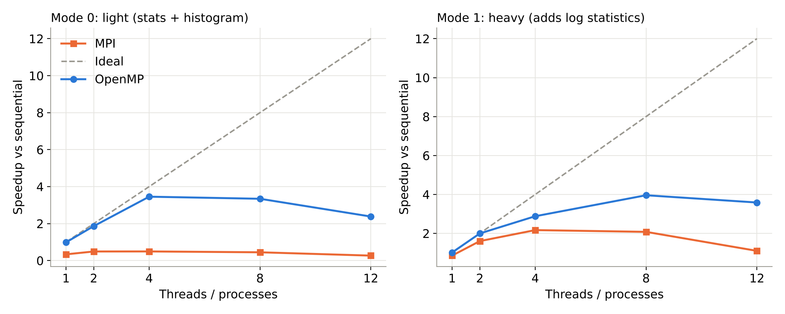
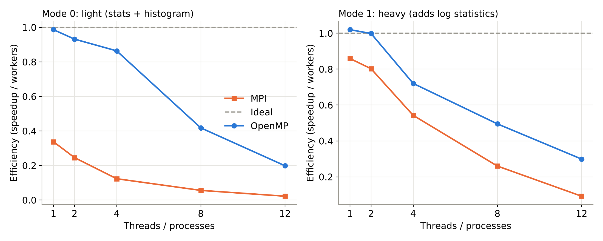
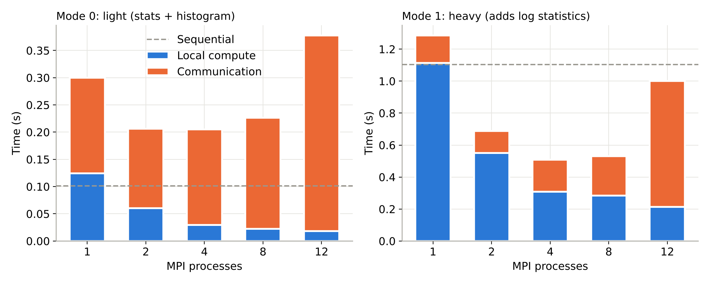
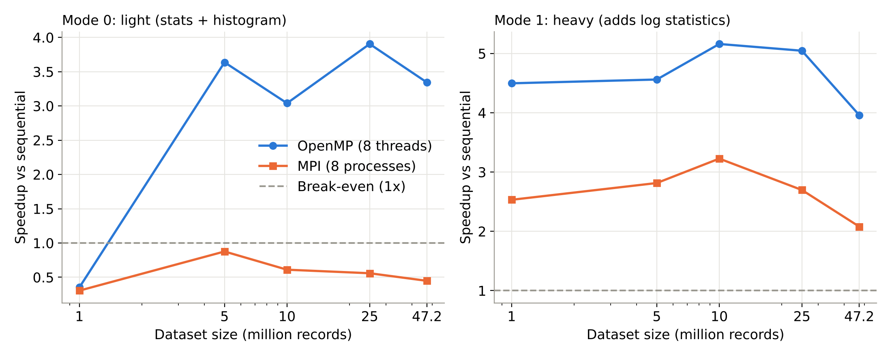
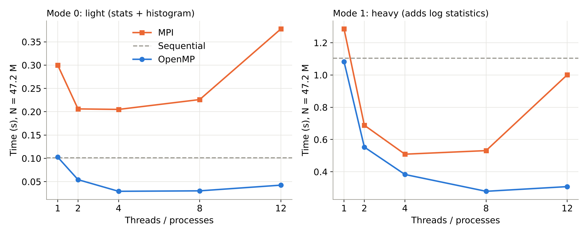
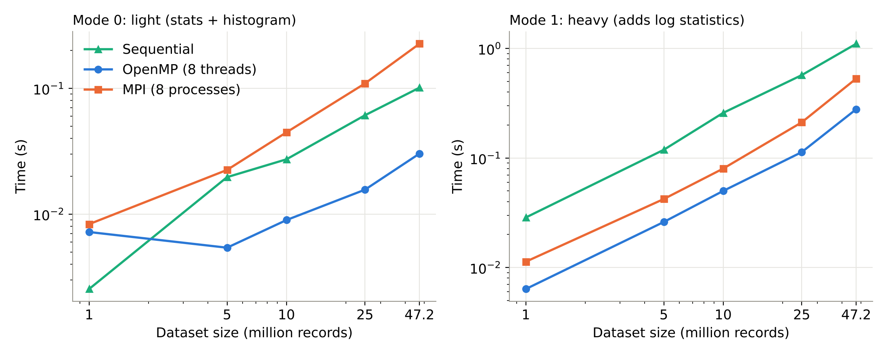

# OpenMP vs MPI for Data Processing

Mini project for **Parallel and GPU Computing (26ECAC304)**.
Theme: perform the same dataset operations with OpenMP and MPI, then compare execution time, speedup and efficiency.

## 1. What we did

1. Took 4 months of NYC Yellow Taxi trip data (47.2 million trips) and extracted the `trip_distance` column into one binary file (378 MB of doubles).
2. Wrote three programs that compute the same statistics: **sequential** (baseline), **OpenMP** (shared memory, threads) and **MPI** (distributed memory, processes).
3. Defined two operations:
   - **Mode 0, light:** count, min, max, mean, standard deviation, number of trips over 10 miles, histogram.
   - **Mode 1, heavy:** everything in mode 0 plus the mean and standard deviation of log(distance).
4. Checked that all three programs give identical results (see section 7).
5. Ran a benchmark: 5 data sizes x 2 modes x (1 sequential + 5 OpenMP + 5 MPI configurations) x 5 repeats = **550 timed runs**.
6. Computed speedup and efficiency, drew the graphs (`graphs/`) and built the presentation (`report/PGC_OpenMP_vs_MPI.pptx`).

**Main finding:** OpenMP is faster on one machine. MPI's computation scales as well as OpenMP's, but rank 0 must scatter the whole 378 MB to the other processes, and that communication does not shrink as processes are added.

## 2. Folder layout

```
README.md          this file
data/              dataset notes (the data itself is not in the zip)
src/               source code + benchmark and analysis scripts
results/           raw runs, summary table, system info, data-cleaning log
graphs/            the six result graphs (PNG)
report/            the presentation (PPTX)
```

## 3. Environment

```
CPU      : 12th Gen Intel(R) Core(TM) i5-12450H (1 socket; 8 cores = 4P + 4E; WSL shows 12 logical CPUs)
lscpu    : Thread(s) per core: 2 | Core(s) per socket: 6 (as exposed by WSL) | Socket(s): 1
nproc    : 12
Memory   : 7.6 GiB total, 2.0 GiB swap (WSL2)
OS       : Ubuntu 24.04 (noble) on WSL2
Compiler : gcc 13.3.0 (-O2); Open MPI 4.1.6
```

## 4. Commands

### 4.1 Setup (WSL Ubuntu)
```bash
sudo apt update
sudo apt install openmpi-bin libopenmpi-dev python3-pandas -y
mpicc --version && mpirun --version
mkdir -p ~/pgc_project/data && cp -r /mnt/c/Users/<you>/Downloads/archive ~/pgc_project/data/
```

### 4.2 Prepare the data
```bash
cd ~/pgc_project
python3 scripts/prepare_data.py | tee results/prepare_data_output.txt
FULL=$(( $(stat -c %s data/trip_distance_all.bin) / 8 ))     # 47248723
```

### 4.3 Compile
```bash
gcc -O2 src/seq.c -o src/seq -lm
gcc -O2 -fopenmp src/omp.c -o src/omp -lm
mpicc -O2 src/mpi_stats.c -o src/mpi_stats -lm
```

### 4.4 Run one configuration
```bash
./src/seq data/trip_distance_all.bin $FULL 1                  # args: file N mode
./src/omp data/trip_distance_all.bin $FULL 1 8                # args: file N mode threads
mpirun --use-hwthread-cpus -np 8 ./src/mpi_stats data/trip_distance_all.bin $FULL 1   # args: file N mode
```
`--use-hwthread-cpus` is needed because WSL reports fewer physical cores than the 8 or 12 processes we start.
Each program prints a `CSV,...` line that the benchmark script collects.

### 4.5 Full benchmark (about 30-40 min, charger on, nothing else running)
```bash
cd ~/pgc_project
nohup ./src/bench_local.sh > results/bench_log.txt 2>&1 &
wc -l results/local_results.csv      # expect 551 (1 header + 550 runs)
```

### 4.6 Speedup, efficiency and graphs
```bash
python3 src/analyze.py     # reads results/local_results.csv, writes results/summary_stats.csv and graphs/*.png
```

## 5. How the numbers are defined

- Every point is the **mean of 5 runs**.
- **Time** = compute time for sequential and OpenMP; **scatter + compute + reduce** for MPI. File reading is excluded for all three so they are comparable.
- MPI communication is the largest value among the processes; local compute is total minus communication (a close estimate).
- **Speedup** = sequential time / parallel time at the same data size and mode.
- **Efficiency** = speedup / number of workers.

## 6. Results (full dataset, 47,248,723 records)

Sequential baseline: **0.101 s** (mode 0, light) and **1.104 s** (mode 1, heavy).

### Mode 0, light operation
| Workers | OpenMP time (s) | OpenMP speedup | OpenMP eff. | MPI time (s) | MPI comm (s) | MPI speedup | MPI eff. |
| --- | --- | --- | --- | --- | --- | --- | --- |
| 1 | 0.103 | 0.99x | 99% | 0.300 | 0.175 | 0.34x | 34% |
| 2 | 0.054 | 1.86x | 93% | 0.206 | 0.146 | 0.49x | 25% |
| 4 | 0.029 | 3.45x | 86% | 0.205 | 0.175 | 0.49x | 12% |
| 8 | 0.030 | 3.34x | 42% | 0.226 | 0.204 | 0.45x | 6% |
| 12 | 0.042 | 2.38x | 20% | 0.378 | 0.359 | 0.27x | 2% |

### Mode 1, heavy operation
| Workers | OpenMP time (s) | OpenMP speedup | OpenMP eff. | MPI time (s) | MPI comm (s) | MPI speedup | MPI eff. |
| --- | --- | --- | --- | --- | --- | --- | --- |
| 1 | 1.083 | 1.02x | 102% | 1.286 | 0.172 | 0.86x | 86% |
| 2 | 0.553 | 2.00x | 100% | 0.688 | 0.138 | 1.60x | 80% |
| 4 | 0.383 | 2.88x | 72% | 0.509 | 0.201 | 2.17x | 54% |
| 8 | 0.279 | 3.96x | 49% | 0.531 | 0.247 | 2.08x | 26% |
| 12 | 0.308 | 3.59x | 30% | 1.001 | 0.788 | 1.10x | 9% |

### Effect of data size (8 workers)

**Mode 0, light**

| N (million) | Sequential (s) | OpenMP 8T (s) | OpenMP speedup | MPI 8P (s) | MPI speedup |
| --- | --- | --- | --- | --- | --- |
| 1.0 | 0.0025 | 0.0072 | 0.35x | 0.0083 | 0.31x |
| 5.0 | 0.0197 | 0.0054 | 3.64x | 0.0225 | 0.88x |
| 10.0 | 0.0273 | 0.0090 | 3.04x | 0.0447 | 0.61x |
| 25.0 | 0.0611 | 0.0156 | 3.90x | 0.1093 | 0.56x |
| 47.2 | 0.1012 | 0.0303 | 3.34x | 0.2261 | 0.45x |

**Mode 1, heavy**

| N (million) | Sequential (s) | OpenMP 8T (s) | OpenMP speedup | MPI 8P (s) | MPI speedup |
| --- | --- | --- | --- | --- | --- |
| 1.0 | 0.0286 | 0.0064 | 4.50x | 0.0113 | 2.53x |
| 5.0 | 0.1188 | 0.0261 | 4.56x | 0.0422 | 2.81x |
| 10.0 | 0.2582 | 0.0500 | 5.16x | 0.0800 | 3.23x |
| 25.0 | 0.5706 | 0.1131 | 5.05x | 0.2115 | 2.70x |
| 47.2 | 1.1042 | 0.2789 | 3.96x | 0.5312 | 2.08x |

### Graphs

| | |
| --- | --- |
| Speedup |  |
| Efficiency |  |
| MPI compute vs communication |  |
| Speedup vs data size |  |
| Time vs workers |  |
| Time vs data size |  |

## 7. Correctness check

Sequential, OpenMP and MPI give identical results on the full data:

```
Mean = 2.870588  Std = 3.563598  Min = 0.00  Max = 500.00
Trips > 10 miles = 2425865
Log-mean = 1.122182  Log-std = 0.609154          (mode 1)
Histogram first 5 bins: 11441582 15924938 7577839 3747122 2094280
```

## 8. Analysis

- **OpenMP wins on one machine.** Best speedup 3.96x (heavy, 8 threads) and 3.45x (light, 4 threads). Threads share the array, so nothing is copied.
- **MPI pays for communication.** At 8 processes, communication is 47% of MPI's time in heavy mode and 90% in light mode. Rank 0 sends all 378 MB whatever the process count, which acts as a serial fraction (Amdahl's law).
- **Light work does not pay off in MPI.** The maths takes about 0.1 s, less than the time to move the data, so MPI is slower than sequential at every size and process count (at most 0.49x on the full data).
- **Heavy work scales in both models**, but MPI reaches only 2.17x (4 processes) against OpenMP's 3.96x.
- **Small data hurts OpenMP too.** In light mode with 1 M records, 8 threads are slower than sequential (0.35x): thread start-up costs more than the work.
- **12 workers are worse than 8.** The CPU has 8 physical cores (4 performance + 4 efficiency) and 12 logical CPUs, so extra workers share cores. MPI at 12 processes drops to 1.10x in heavy mode, with communication rising to 0.79 s.
- **MPI with 1 process is below 1x** (0.86x heavy) because scatter still copies the whole array into a second buffer.

## 9. Limitations and next steps

- All MPI runs so far share memory inside one laptop, so real network cost is not included.
- One dataset, one kind of statistics, one machine (WSL2).
- **Planned:** run MPI across 4 Ubuntu VMs (install Open MPI 4.1.6 on each, passwordless SSH from the master, a hostfile, copy the binary and data to the same path on every node) and compare with the local MPI results.
